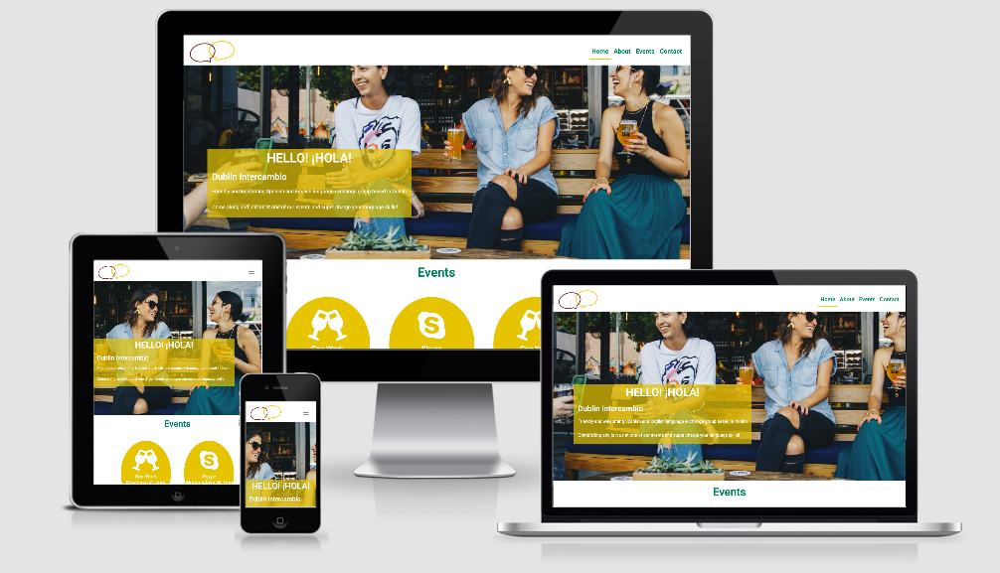
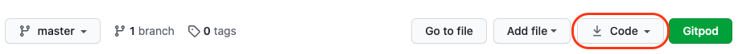

<h1 align="center">
  <a href="">Dublin Intercambio</a>
</h1>



<div align="center"> 
[View Dublin Intercambio in GitHub Pages](https://donnaib.github.io/dublin_intercambio/)
</div>

Note: This is a fictional organisation created for this milestone project.

Dublin Intercambio is a not-for-profit organisation set up to facilitate learners of both Spanish and English to practise what their new found language skills in a real life settings with native speakers. 

Dublin Intercambio provides opportunites for people to get together in informal, relaxed settings, overcome the fear that many have of speaking in their target language and meet like minded people.

User goals:
* To find out how to take part in a language exchange
* To find other like minded people to practise their language skills with.
* To improve their language skills

Website owers goals:
* Build awareness of the events.
* Increase attendance at the events.
* Create a friendly, relaxed and inviting feel, as attending a language exchange event for the first time can be daunting.

 
## UX

#### User stories

##### A typical user of this site would:
* Has an interest in improving their level of Spanish or English
* Live in the Dublin - or planning a trip to Dublin
* Speak English (to some degree)

##### This project is the best way to help them achieve these things because:
* Often language exchange websites are very poorly designed and can seem complicated.
* Often language exhange website can seem impersonal and uninviting.
* The Dublin Intercambio website:
    * Is easy to navigate.
    * Has a warm, friendly and inviting feel to it.
    * Ensures the important information is easy to find and access.
    * Encouraging users to attend the events and get involved.

##### User stories
1. As a new visitor to the website, I want to know where and when the language exchange events are taking place.
2. As a new visitor to the website, I want to get a sense of what the language exchange will be like.
3. As a new visitor to the website, I want to ask to join the online event.
4. As a returning visitor to the website, I want to easily remind myself where and when the events are.
5. AS a returning visitor to the website, I want to aquire the details for the virtual event.


##### Wireframes and mockups: 

Add links/images here

## Features

### Pages 

##### Home
The home page features a warm, friendly hero image to create the sense of the warm, friendly enviroment that Dublin Intercambio events pride themselves on. While the page is fully responsive, I also
created a few different versions of the image to ensure that at each size the image was displaying a friendly face, to ensure that no matter what device it is viewed on that it protrays/conveys the 
character of the events.

The Home page also includes a call to action, inviting the user to come and join one of our events.  The home page also includes a teaser of the event information. The user can see the key deatils, 
such as date, time and location of the events with a button to navigate them through to see futher details. The events teasers allows returning visitors to easily see at a glance the information they 
may need reminding of without having to go futher into the site.
 
The buttons on the event teasers contain links are anchor tags to insure that users are taken to the correct part of the page for the event they selected, this is not relevant on large screen sizes 
but will be helpful on smaller screen sizes, where without them the user would have to scroll to find the event they wanted the details of.

##### About
The about page features another warm and friendly image, and again smaller version of the image have been created for smaller screen sizes to make sure they always convey the atmosphere of the events.

There is then a personable introduction and history of Dublin Intercambio and some details about why intercambios or language exchanges are important and some easy to read bullet points highlighting
5 key reasons to come along to an event.

##### Events
The events pages provides aditional deatils to the users about the events and how to attend.  One of the events requires the users to register and there is a link within the text to allow the user to easily
access the form on the contact page where the users can register their interest in attending the event. Again this page features a friendly image of a group of people chatting, continuing the theme throughout 
the entire site.

##### Contact
The contact page features yet another friendly, welcoming image to continue the theme. In addition, the contact page's main feature is the contact form. A simple, clear form, only requesting data that is 
required to process the users request. The form fields have validation added and require that all fields, excluding the check box, have the right data added. The contact form allows users to get in touch
with the event organisers and ask any questions they may have.  The form features a check box if the user is requesting joining details for the virtual event, allowing the organisers to easily identify such 
requests.

NOTE: As this is for a milestone 1 project I have left the method and post values blank as to create a working form would be beyond the scope of this project.

### Existing 
Every page on this site also incorporates the following features:
* A logo in the top left hand corner, that not only forms part of the branding and design of the site but also as is consitant with a users expectations, clicking the logo will return the user to the 
home page fo the site.
* A responsive, collapsible navigation bar, allowing users to easily navigate the site on any device.
* A responsive footer with social media links. allowing users to easily connect with Dublin Intercambio via social media. Each link opens in a new tab.


### Possible Features to Implement in Future
- Adding Spanish translations for users who maybe don't have an intermediate level of English yet.
- Adding a blog with language learning tips and stories.
- Adding booking system for the online events as those numbers are restricted.
- Adding GDPR compliant Privacy and Cookie polices.

## Technologies Used
- This project uses HTML and CSS programming languages with a little bit of Javascript.
- Gitpod was used an the IDE for building the site.
- The project uses **Bootstrap4** to assist with the structure, responsiveness and browswer compatibility of the site. 
- The project also uses BootstrapCDN to provide icons from **Font Awesome**.
- The project uses **Google fonts** to style the website fonts.
- The project uses **jQuery** to reference Javascript needed for the responsive navbar.
- The project uses **Popper,js** reference Javascript needed for the responsive navbar.


## Testing 
I tested the site in the following ways:

1. Initially I used the inspector tool to test the site in all the screen sizes and devices available in the Chrome developer tool.  In addition to this I also tested it on 
live devices, including but not limted to iPhone, iPad, MacBook Pro. 

2. I also tested my code using the [W3C Validator Tools](https://validator.w3.org/) for both my HTML and CSS.  Running my code through these tools highlighted a few issues with syntax 
which were fixed at the time and pushed as bug fixes.

Events Teasers:
    1. On a device with a screen size of 768px or smaller, navigate to the Home page of the site, scroll down to see the event section with the yellow circular event teasers.
    2. Click the "details' button on the Friday event, verify that you are taken to the correct part of the events page, that is relevant to the Friday event.

Contact form:
    1. Navigate to the "Contact" page
    2. Try to submit the empty form and verify that an error message about the required fields appears
    3. Try to submit the form with an invalid email address and verify that a relevant error message appears
    4. Try to submit the form with all inputs valid and verify that is accepted. (Please note as this is a milestone 1 project, the form is not fullying working and therefore the data is not submitted)

## Deployment

To deploy this page to GitHub Pages from its [GitHub repository](https://github.com/DonnaIB/dublin_intercambio), the following steps were taken: 
1. Log into GitHub. 
2. From the list of repositories on the screen, select 
3. From the menu items near the top of the page, select **Settings**.
4. Scroll down to the **GitHub Pages** section.
5. Under **Source** click the drop-down menu labelled **None** and select **Master Branch**
6. On selecting Master Branch the page is automatically refreshed, the website is now deployed. 
7. Scroll back down to the **GitHub Pages** section to retrieve the link to the deployed website.

At the time of submission, the Development Branch and Master Branch were identical. 

### How to run this project locally

To clone this project from GitHub:
1. Follow this link to the [Project GitHub repository](https://github.com/DonnaIB/dublin_intercambio).
2. Under the repository name, click 'Code'



3. In the Clone with HTTPs section, copy the clone URL for the repository. 
4. In your local IDE open Git Bash.
5. Change the current working directory to the location where you want the cloned directory to be made.
6. Type ```git clone```, and then paste the URL you copied in Step 3.
```console
git clone https://github.com/DonnaIB/dublin_intercambio.git
```
7. Hit enter and your local clone will be created.

## Credits

### Content
The content of the site was written by myself but was inspired and influenced by the following sites:
* [My language Exchange](https://www.mylanguageexchange.com/)
* I Will Teach You. Language](https://iwillteachyoualanguage.com/)

### Media
- All images used in this site were obtained from https://www.canva.com/photos/

### Code
- Code for my navigation was adapted and cusomtised from a code snippet found in the Bootstrap documentation.

### Acknowledgements

* My color scheme for this site was based on the colors in the Spanish flag and I used a colour scheme from [Scheme Color](https://www.schemecolor.com/spain-flag-colors.php), the specific color combination was created by user Keshav Naidu.
* Thank you to Cormac from Tutor Support - who helped me with a styling issue with my nagivation.
* Thank you to JymLinx in Slack for helping me with a positioning issue on my home page.
* I refered to w3.org to assist with the styling of my bullet points.
* Thank you to JimLinx & Richard K in the Slack community for taking the time to review this site and offering some helpful information on how the site looks in android devices as well as drawing my attention
to a bug on the contact page that was subsequently fixed. 
* I refered to AJ Greave's sample README to help structure this README file.


