<h1 align="center">
  <a href="https://donnaib.github.io/dublin_intercambio/">Dublin Intercambio</a>
</h1>

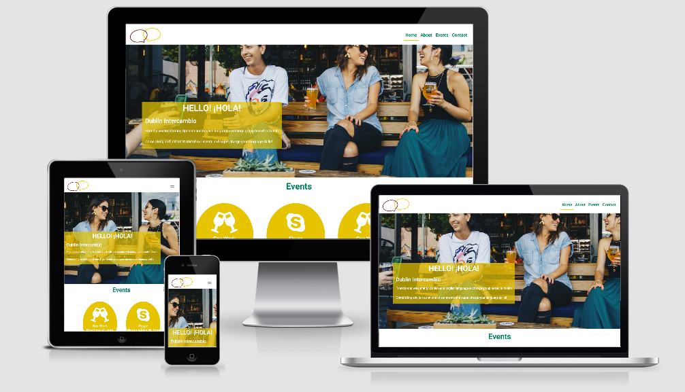

[View Dublin Intercambio in GitHub Pages](https://donnaib.github.io/dublin_intercambio/)


*Note: This is a fictional organisation created for a Code Institute milestone project.*
## Introduction

Dublin Intercambio is a not-for-profit organisation set up to facilitate learners of both Spanish and English to practise their 
new found language skills in a real life settings with native speakers. 

Dublin Intercambio provides opportunites for people to get together in informal, relaxed settings, to overcome the fear that many have 
of speaking in their target language with meet like minded people.

## Scope 

Create a simple, intuitive, and responsive website for Dublin Intercambio events. The site should be no more than 4 pages long and will 
be a simple brochure website, providing information in a clear and structured that is easily understandable to users.  The structure should 
adhere to convetion and be simple and intuitive, ensuring the user always knows where they are, how they got there and how to get back to 
where they started.

The design should create a warm and welcoming feel, creating the atmosphere that Dublin Intercambio pride themselves on at their live events.

Any addition features or functionaly are out of scope at this stage.

User goals:
* To find language exchange events in Dublin
* To find out how to take part in a language exchange
* To improve their language skills

Website owers goals:
* Build awareness of the events.
* Increase attendance at the events.
* Create a friendly, relaxed and inviting feel, as attending a language exchange event for the first time can be daunting.

 
## UX

#### User stories

##### A typical user of this site would:
* Have an interest in improving their level of Spanish or English
* Live in the Dublin - or planning a trip to Dublin
* Speak English (to some degree)

##### This project is the best way to help them achieve these things because:
* Often language exchange websites are very poorly designed and can seem complicated.
* Often language exhange website can seem impersonal and uninviting.
* The Dublin Intercambio website:
    * Is easy to navigate.
    * Has a warm, friendly and inviting feel to it.
    * Ensures the important information is easy to find and access.
    * Encourages users to attend the events and get involved.

##### User stories
1. As a new visitor to the website, I want to know where and when the language exchange events are taking place.
2. As a new visitor to the website, I want to get a sense of what the language exchange will be like.
3. As a new visitor to the website, I want to ask to join the online event.
4. As a returning visitor to the website, I want to easily remind myself where and when the events are.
5. As a returning visitor to the website, I want to aquire the details for the virtual event.


### Design (Wireframes and Mockups): 

After coming up with the concept, mapping out the scope of the site, and working through the user stories and turned my attention to the layout. I began the process of creating wireframes with good old fashioned pen and paper to get a very rough skeleton of the site to start giving form to the agreed function.

With a basic outline I moved to Balsamiq to create more detailed Wireframes for the site. 

### Wireframes

#### Home Page
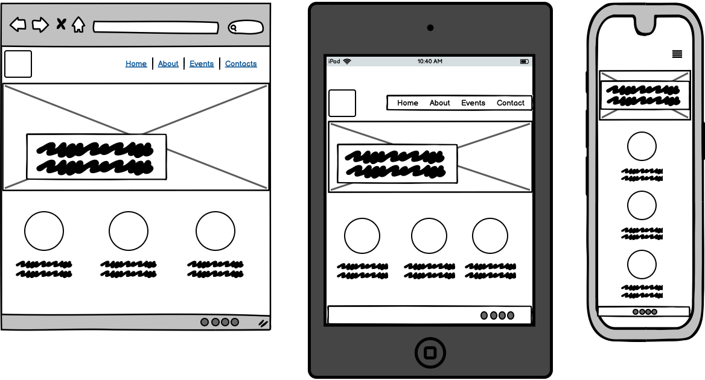

#### About Page
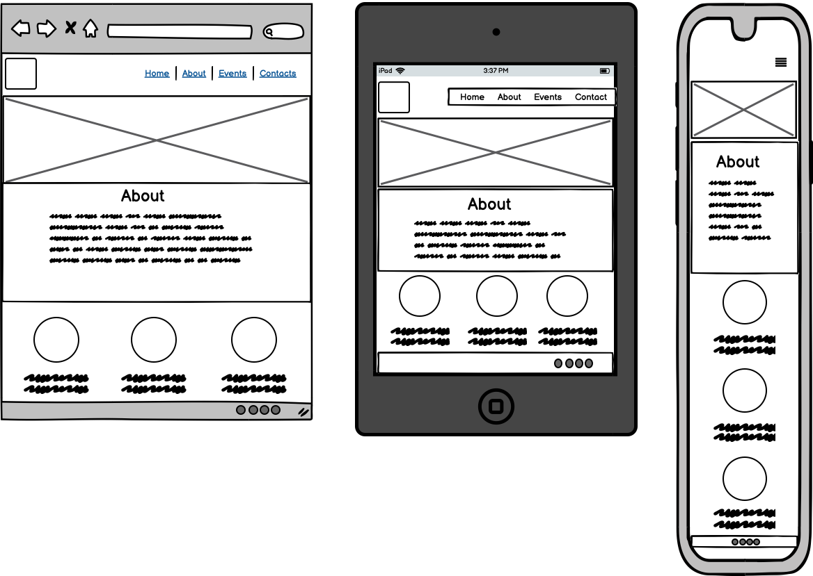

#### Events Page
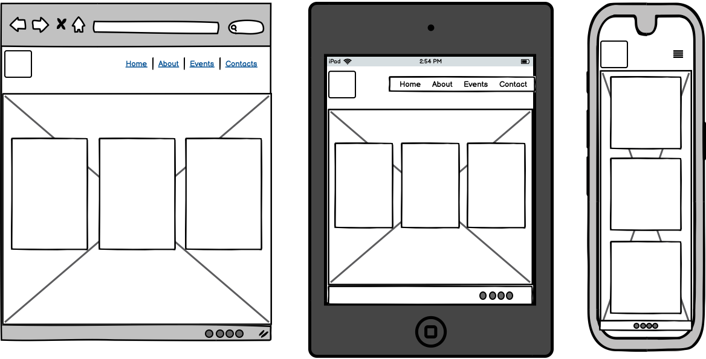

#### Contact Page
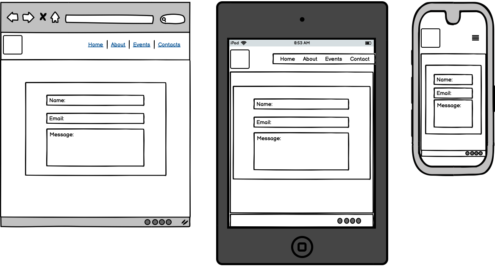


After creating the wireframes to define the structure, I moved on to creating mockups using powerpoint to focus on the look and feel of the site as this was an important element of the prject.

The inspiration for the color theme of the website was born from the combination of the warm and friendly atmosphere that was required and 
also from the colours of the Spanish flag.  I wanted to harness the Spanish connection and influence of the project.   

While I am aware that yellow can sometimes be a problematic colour, it was an important element of the design due the fact that it is 
a key colour of the Spansih flag. With this in mind special attention was given to testing the contract of the white text against the yellow
backgrounds to ensure readability. This was discussed at length with my tutor at all stages of this project to ensure the right balance was met.


### Mockups
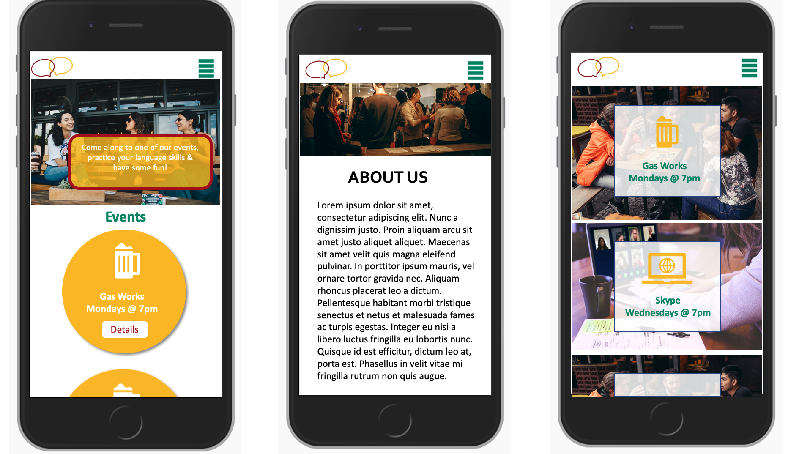

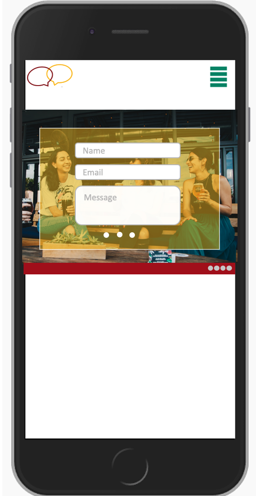

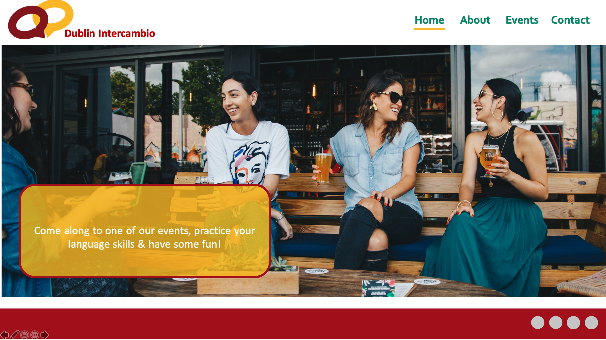

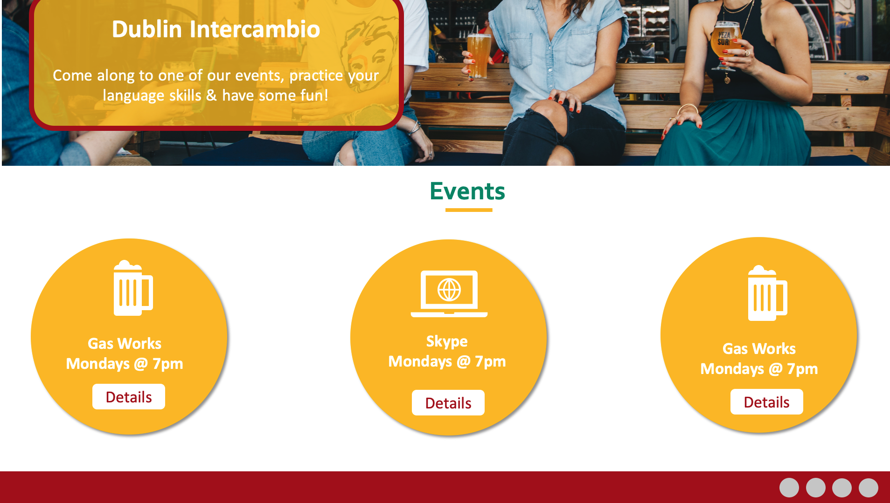


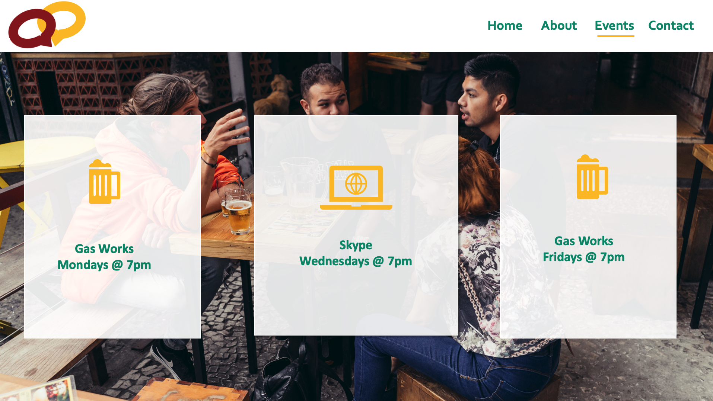

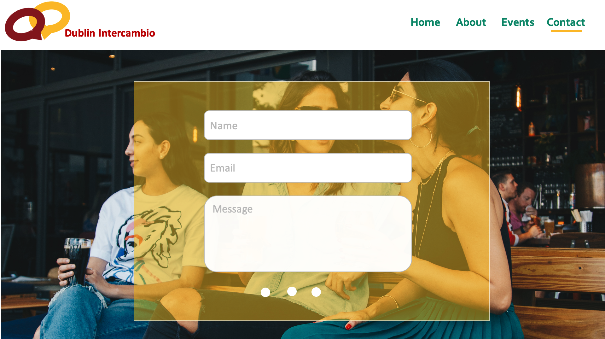

During the build I stuck closely to the above wireframes and mockups, only make small adjustments here and there to colour or layout, to 
optimise the site.

## Features

### Pages 

##### Home
The home page features a warm, friendly hero image to create the sense of the warm, friendly enviroment that Dublin Intercambio events pride themselves on. While the page is fully responsive, I also
created a few different versions of the image to ensure that at each size the image was displaying a friendly face, to ensure that no matter what device it is viewed on that it protrays/conveys the 
character of the events.

The Home page also includes a call to action, inviting the user to come and join one of our events.  The home page also includes a teaser of the event information. The user can see the key deatils, 
such as date, time and location of the events with a button to navigate them through to see futher details. The events teasers allows returning visitors to easily see at a glance the information they 
may need reminding of without having to go futher into the site.
 
The buttons on the event teasers contain links are anchor tags to insure that users are taken to the correct part of the page for the event they selected, this is not relevant on large screen sizes 
but will be helpful on smaller screen sizes, where without them the user would have to scroll to find the event they wanted the details of.

##### About
The about page features another warm and friendly image, and again smaller version of the image have been created for smaller screen sizes to make sure they always convey the atmosphere of the events.

There is then a personable introduction and history of Dublin Intercambio and some details about why intercambios or language exchanges are important and some easy to read bullet points highlighting
5 key reasons to come along to an event.

##### Events
The events pages provides aditional deatils to the users about the events and how to attend.  One of the events requires the users to register and there is a link within the text to allow the user to easily
access the form on the contact page where the users can register their interest in attending the event. Again this page features a friendly image of a group of people chatting, continuing the theme throughout 
the entire site.

##### Contact
The contact page features yet another friendly, welcoming image to continue the theme. In addition, the contact page's main feature is the contact form. A simple, clear form, only requesting data that is 
required to process the users request. The form fields have validation added and require that all fields, excluding the check box, have the right data added. The contact form allows users to get in touch
with the event organisers and ask any questions they may have.  The form features a check box if the user is requesting joining details for the virtual event, allowing the organisers to easily identify such 
requests.

NOTE: As this is for a milestone 1 project I have left the method and post values blank as to create a working form would be beyond the scope of this project.

### Site Features 
Every page on this site also incorporates the following features:
* A logo in the top left hand corner, that not only forms part of the branding and design of the site but also as is consitant with a users expectations, clicking the logo will return the user to the 
home page fo the site.
* A responsive, collapsible navigation bar, allowing users to easily navigate the site on any device.
* A responsive footer with social media links. allowing users to easily connect with Dublin Intercambio via social media. Each link opens in a new tab.

### Possible Features to Implement in Future
- Adding Spanish translations for users who maybe don't have an intermediate level of English yet.
- Adding a blog with language learning tips and stories.
- Adding booking system for the online events as those numbers are restricted.
- Adding GDPR compliant Privacy and Cookie polices.

## Technologies Used for building this site
- This project uses HTML and CSS programming languages with a little bit of Javascript.
- Gitpod was used an the IDE for building the site.
- **Bootstrap4** was used to assist with the structure, responsiveness and browswer compatibility of the site. 
- BootstrapCDN was used to provide icons from **Font Awesome**.
- **Google fonts** was used to style the website fonts.
- **jQuery** to reference Javascript needed for the responsive navbar.
- **Popper,js** reference Javascript needed for the responsive navbar.
- **TinyPNG** was used to reduce the size of the images to help with load time.

## Testing 
I tested the site in the following ways:

1. Initially I used the inspector tool to test the site in all the screen sizes and devices available in the Chrome developer tool.  In addition to this I also tested it on live devices, including but not limted to iPhone, iPad, MacBook Pro, MotoG7. 

2. I also tested my code using the validator tools for both my HTML [W3C HTML Validator Tool](https://validator.w3.org/) and CSS [W3C CSS Validator Tool](https://validator.w3.org/). Running my code through these tools highlighted a few issues with syntax which were fixed at the time and pushed as bug fixes.

Screen shots of the validator results can be viewed below, as you can see there were no errors detected.

### HTML reports 
* 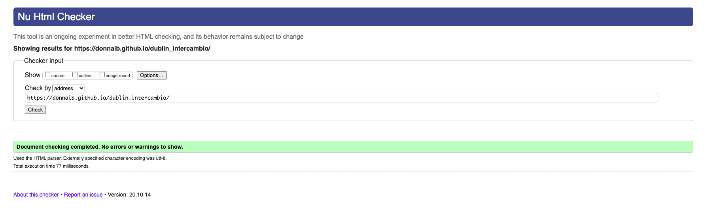
* 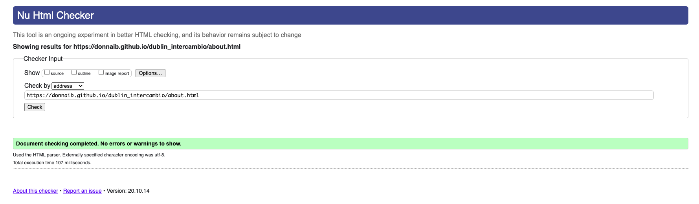
* 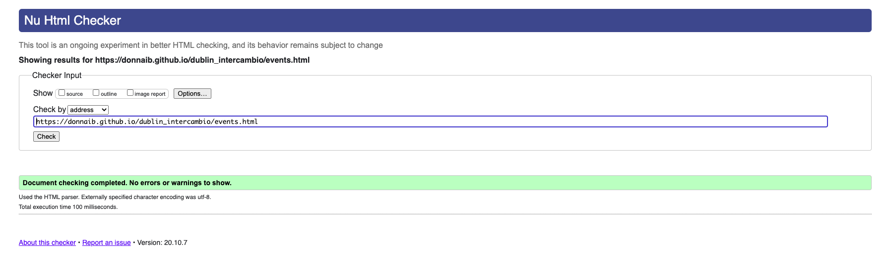
* 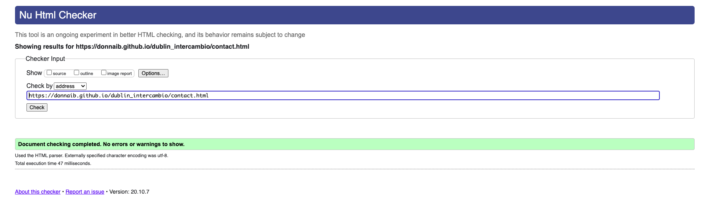
* 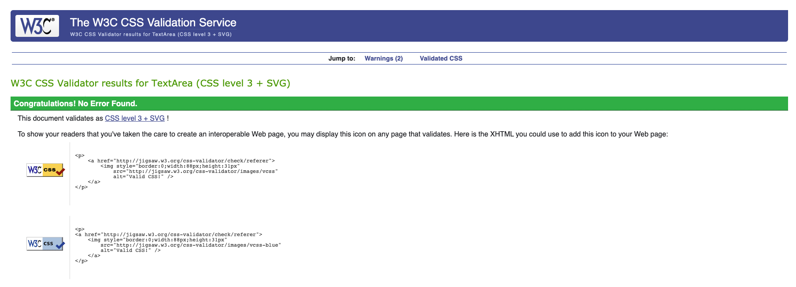

3. In addition to testing with the inspector tool, real devices and validation tools, I also work through a series of test cases, to ensure that the site met the users cases and that any functionality that was added worked as intented.

### User Story Test Cases
1. As a new visitor to the website, I want to know where and when the language exchange events are taking place.
There are two ways for a user to find this information, firstly there is the basic information on the home page in the events section, which provides the date, time and name of the venue. The user can then click on the more details button to access more information about the event. The user could also choose to click the events page from the navigation bar and go directly to the events page.

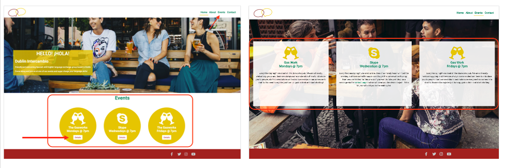

2. As a new visitor to the website, I want to get a sense of what the language exchange will be like.
The imagery used through the site is intended to give the users a feel of the open and friendly sense of the live events.

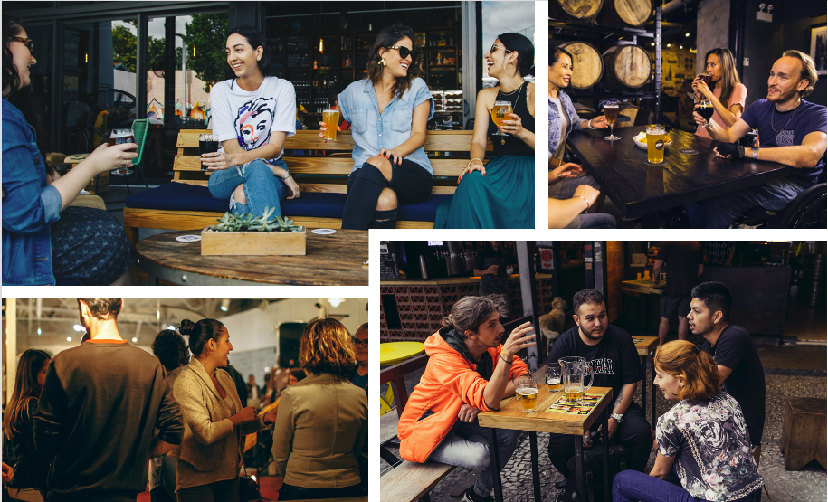

3. As a new visitor to the website, I want to ask to join the online event.
There is information on the events page that details how a user can join the events. In the case of an online event the user needs to contact Dublin Intercambio and there is a link from the events page through to the contact form.  Alternatively the user can chose to navigate directly to the contact page using the navigation bar and clicking on contact.

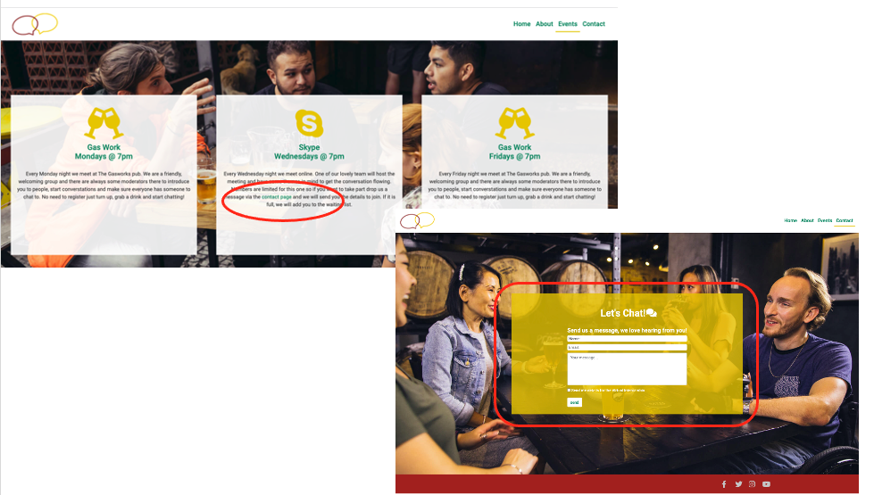

4. As a returning visitor to the website, I want to easily remind myself where and when the events are.
Having the event teasters, the basic information on the home page it allows users who are returning to the date, time and location at a glance.  Alternatively, they can chose events from the navigation menu and go directly to the events page.


5. As a returning visitor to the website, I want to aquire the details for the virtual event.
A returning visitor may know that they have to contact Dublin Intercambio for joining details so can skip straight to the contact page to get in touch. Alternatively if they need reminding they can visit the events page and read the details on the virtual meeting events card.


### Functionaly Test Cases

Events Teasers:
1. On a device with a screen size of 768px or smaller, navigate to the Home page of the site, scroll down to see the event section with the yellow circular event teasers.
2. Click the "details' button on the Friday event, verify that you are taken to the correct part of the events page, that is relevant to the Friday event.

Contact form:
1. Navigate to the "Contact" page.
2. Try to submit the empty form and verify that an error message about the required fields appears.
3. Try to submit the form with an invalid email address and verify that a relevant error message appears.
4. Try to submit the form with all inputs valid and verify that is accepted. (Please note as this is a milestone 1 project, the form is not fullying working and therefore the data is not submitted).


## Deployment

To deploy this page to GitHub Pages from its [GitHub repository](https://github.com/DonnaIB/dublin_intercambio), the following steps were taken: 
1. Log into GitHub. 
2. From the list of repositories on the screen, select 
3. From the menu items near the top of the page, select **Settings**.
4. Scroll down to the **GitHub Pages** section.
5. Under **Source** click the drop-down menu labelled **None** and select **Master Branch**
6. On selecting Master Branch the page is automatically refreshed, the website is now deployed. 
7. Scroll back down to the **GitHub Pages** section to retrieve the link to the deployed website.

At the time of submission, the Development Branch and Master Branch were identical. 

### How to run this project locally

To clone this project from GitHub:
1. Follow this link to the [Project GitHub repository](https://github.com/DonnaIB/dublin_intercambio).
2. Under the repository name, click 'Code'


3. In the Clone with HTTPs section, copy the clone URL for the repository. 
4. In your local IDE open Git Bash.
5. Change the current working directory to the location where you want the cloned directory to be made.
6. Type ```git clone```, and then paste the URL you copied in Step 3.
```console
git clone https://github.com/DonnaIB/dublin_intercambio.git
```
7. Hit enter and your local clone will be created.

## Credits

### Content
The content of the site was written by myself but it was inspired and influenced by the following sites:
* [My language Exchange](https://www.mylanguageexchange.com/)
* [I Will Teach You. Language](https://iwillteachyoualanguage.com/)

### Media
- All images used in this site were obtained from https://www.canva.com/photos/

### Code
- Code for my navigation was adapted and cusomtised from a code snippet found in the Bootstrap documentation.

### Acknowledgements
* My color scheme for this site was based on the colors in the Spanish flag and I used a colour scheme from [Scheme Color](https://www.schemecolor.com/spain-flag-colors.php), the specific color combination was created by user Keshav Naidu.
* Thank you to Cormac from Tutor Support - who helped me with a styling issue with my nagivation.
* Thank you to JymLinx in Slack for helping me with a positioning issue on my home page.
* I refered to w3.org to assist with the styling of my bullet points on the the about page.
* Thank you to JimLinx, Paul Loy & Richard K in the Slack community for taking the time to review this site and offering some helpful information on how the site looks in android devices as well as drawing my attention
to a bug on the contact page that was subsequently fixed. 
* I refered to AJ Greave's sample README as well as the Code Institute sample to help structure this README file.
* Thank you to Mr_Bim_alumni in the Slack community for helping me debug a style issue in my footer and advice on very large screen sizes.
* A final thank to my mentor Aaron Sinnott who has advised and guided me through this milestone 1 project.


